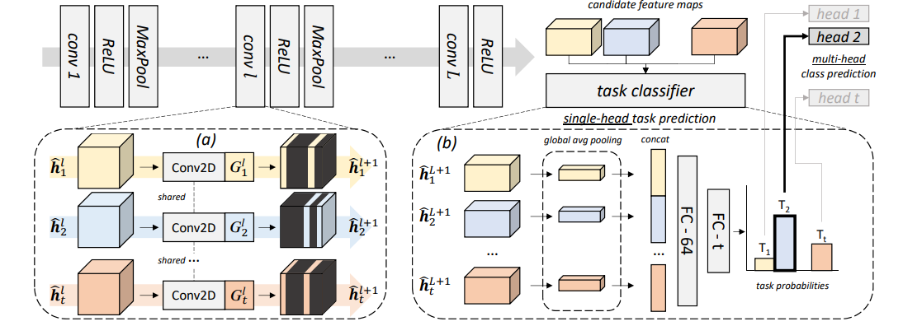
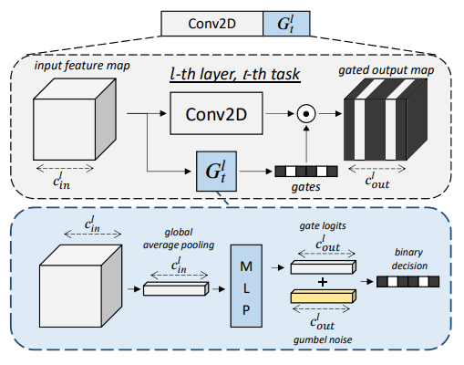
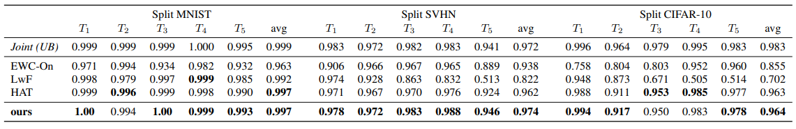
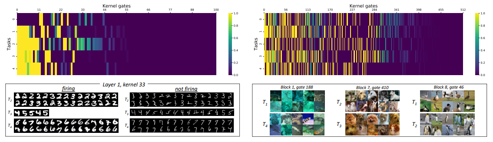
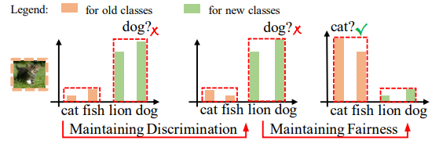
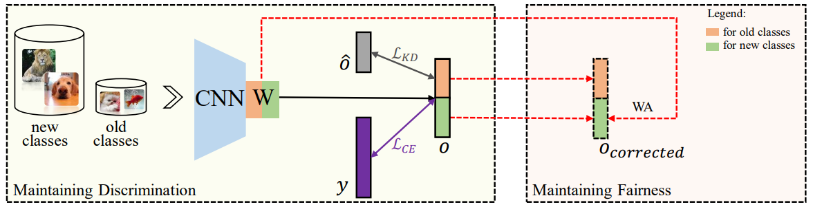
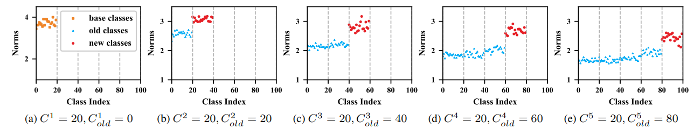
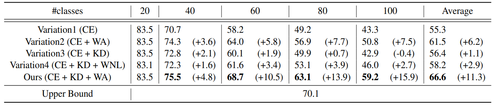
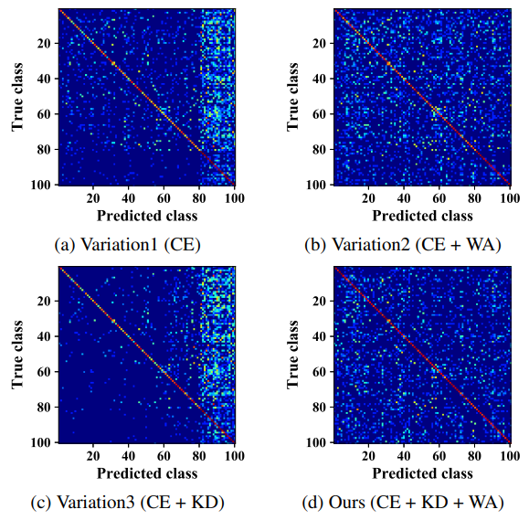

### Conditional Channel Gated Networks for Task-Aware Continual Learning
- **Oral presentation** [(Video)](http://d1tz9o43mm5y8k.cloudfront.net/CVPR20/CVPR20/2376/2376-oral.mp4)

- Goal
    - It proposed a gating network for continual learning.
    
- Overview
    - 
    
- Method
    - 
    - Use a selected convolutional channel via gumbel-softmax
    - Freeze convolutional channels which are selected frequently
    - Regularizer: sparsity objective
        
- Experiments
    - 
    - 

### Maintaining Discrimination and Fairness in Class Incremental Learning
- [(Video)](http://d1tz9o43mm5y8k.cloudfront.net/CVPR20/CVPR20/8842/8842-1min.mp4)

- Goal
    - 
    - Maintain discrimation and fairness for incremental learning
    
- Overview
    - 

- Method
    - Knowledge distillation with rehearsal data
    - 
    - Align so that the last convolution parameters of each task has the same size norm
    
- Experiments
    - 
    - 
