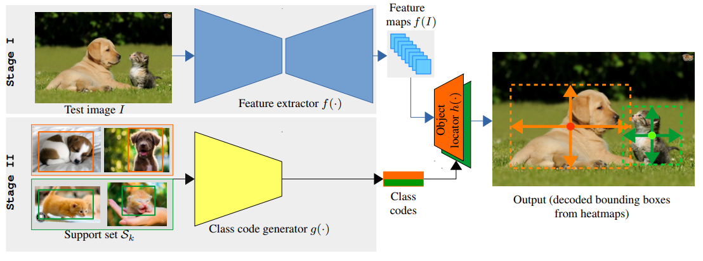
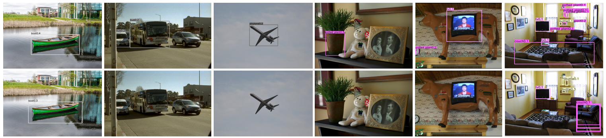
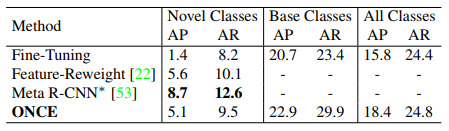
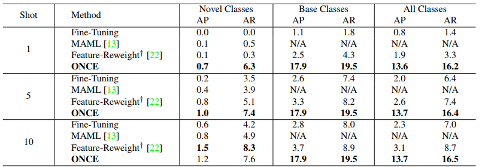
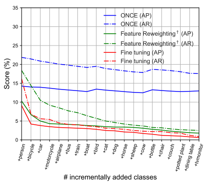
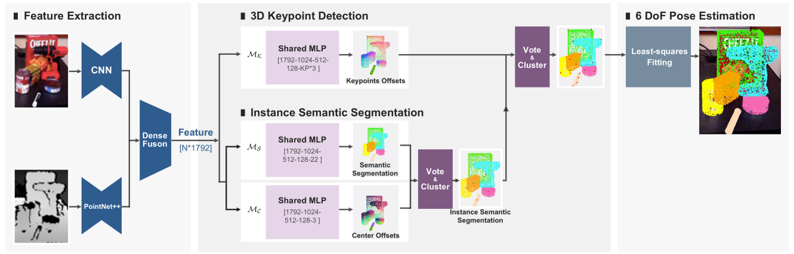
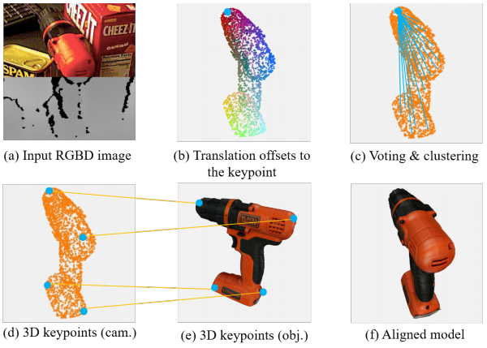
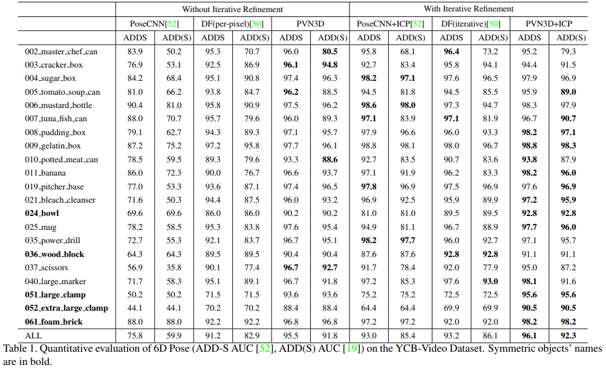
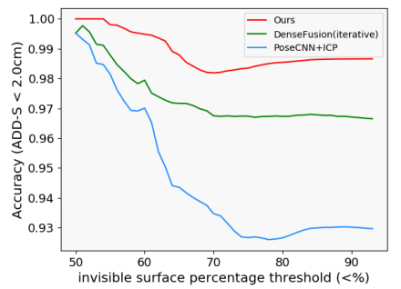
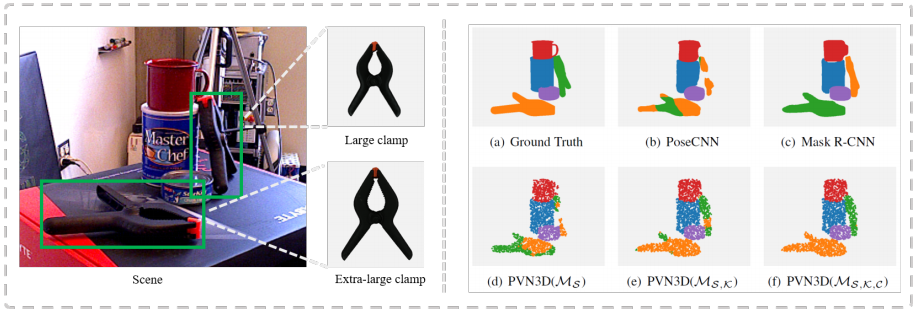

### Incremental Few-Shot Object Detection
- **Oral presentation** [(ONCE_Video)](http://cvpr20.com/event/incremental-few-shot-object-detection2nd-time/)

- Model structure
    - 
    - Feature extractor
        - Input: Image
        - Output: 3D feature map
        - Shared by all the base and novel classes.
        - Fixed while incremental learning.
    - Object locator
        - Input: Feature map
        - Output: Object detection heatmap
        - Class-specific parameters for each individual class
    - Class code generator
        - Input: Few-shot images
        - Output: Class code(Convolutional kernel)
        - Synthesis the weights of object locator given a few-shot data.
        - Meta-learned with base-class training data
- Method
    1. Feature extractor learning
        - CentreNet 기반 모델구조
        - Base-class 데이터에 대해서 학습
        - 학습 후 Fix
    2. Class code generator learning
        - Goal: Generator가 class-specific한 Conv Filter를 잘 생성하는 것
        - Base-class 데이터에서 few-shot으로 sample한 데이터 사용
        - Output으로 생성한 Conv Filter가 바로 Object Locator로 쓰인다.
    3. Meta Testing
        - Novel-class 데이터에 대해 Testing
            - Support set (few-shot data)와 Test image 1장으로 구성
        -  먼저, Support set을 바탕으로 class code(conv filter)를 생성한다.
        -  Test image에서 feature extraction을 거친 후, class code로 bounding box를 찾는다.
        
    - Loss
        - Heatmap L1 regression loss
        
- Experiments
    - Object detection
        - 
    - Non-incremental learning
        - 
    - Incremental learning
        - 
    -   Learning without forgetting
        - 

### PVN3D: A Deep Point-Wise 3D Keypoints Voting Network for 6DoF Pose Estimation
- **Oral presentation** [(Video)](http://cvpr20.com/event/pvn3d-a-deep-point-wise-3d-keypoints-voting-network-for-6dof-pose-estimation2nd-time/)

- Overview
    - 

- Pipeline
    - 

- Experiments
    - 6D Pose Estimation
        - 
    - Invisible surface
        - 
        - 
    - Ablation study
        - 
    - [(Video)](https://www.youtube.com/watch?v=ZKo788cyD-Q)

