###Graph-Structured Referring Expression Reasoning in the Wild
- **Oral presentation** [(Video)](http://d1tz9o43mm5y8k.cloudfront.net/CVPR20/CVPR20/2703/2703-oral.mp4)

- Contributions
    - It proposed a graph-structured reasoning process for the referring task.
    - It introduces a new referring dataset ([Ref-Reasoning](sibeiyang.github.ko/dataset/ref-reasoning)) which includes 
    semantically rich expressions describing objects, attributes, direct and indirect relations with a variety of reasoning layouts.
    
- Overview
    - 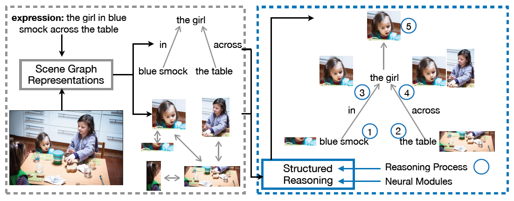
    
- Method
    - 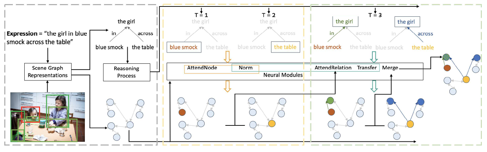
    - Generate a image semantic graph
        - Each node represents an bounding box (object feature and embedded spatial location)
        - Each edge denote the relation between objects
    - Generate a language scene graph
        - Use a scene graph parser to parse the expression into an initial language scene graph.
        - A node and an edge of the graph correspond to an object and the relation between two objects.
        - Each node contains an embedding of the object name
        - Each edge contains two connected nodes (a subject node and a object node) and the relation (preposition/verb)
    - Structural reasoning
        - There are AttendNode, AttendRelation, Transfer, Merge modules.
        - Reasoning order:
            - Find a leaf node of the language scene graph.
            - AttendNode: Find a corresponding visual node from an leaf node of the language scene graph.
            - AttentionRelation: Find a corresponding visual node from intermediate nodes in the language scene graph.      
            - Transfer: Find a new nodes by passing attention weight on nodes.
            - Merge: Combine multiple attention maps generated from different edges of the same node.
    - Loss
        - Cross entropy loss using a ground truth matching between the image semantic graph and the language scene graph.
        
- Ref-Reasoning dataset
    - 
    - 791,956 referring expressions (721,164 for training, 36,183 for validation, and 34,609 for testing) in 83,989 images.
    - It is built on the scenes from the [GQA dataset](https://cs.stanford.edu/people/dorarad/gqa/about.html).
    - 1,664 object classes, 308 relation classes and 610 attribute classes.
    - It provides extracted visual features from Faster R-CNN for ground-truth objects in the images.
    
- Experiments
    - Good Performance
        - 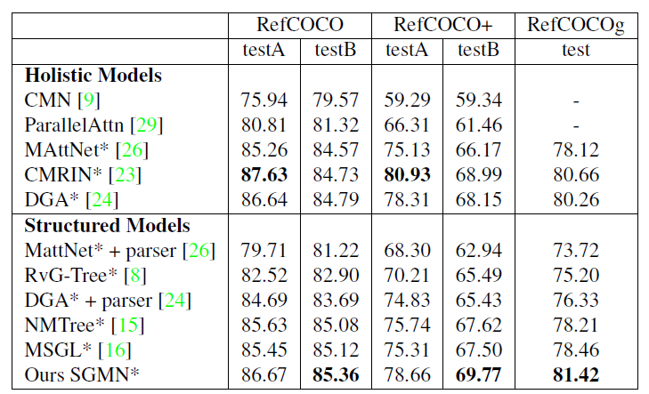
    - Interpretable Visualization
        - 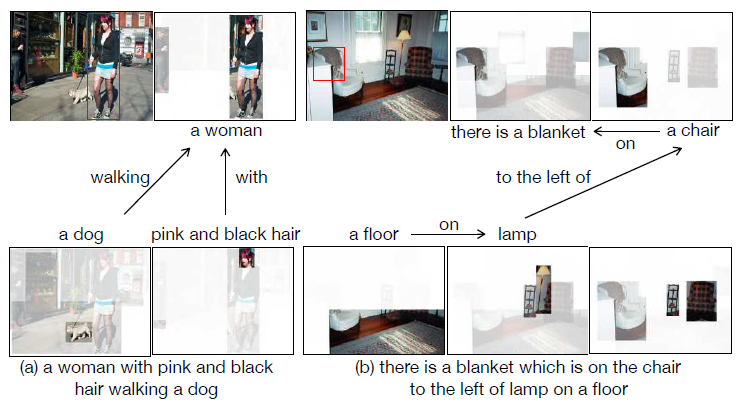

###ALFRED: A Benchmark for Interpreting Grounded Instructions for Everyday Tasks
- [Project Page](https://askforalfred.com/)

- Contributions
    - It introduces a new benchmark for connecting human language to *actions*, *behaviors*, and *objects* in interactive visual environments.
    
- Overview
    - 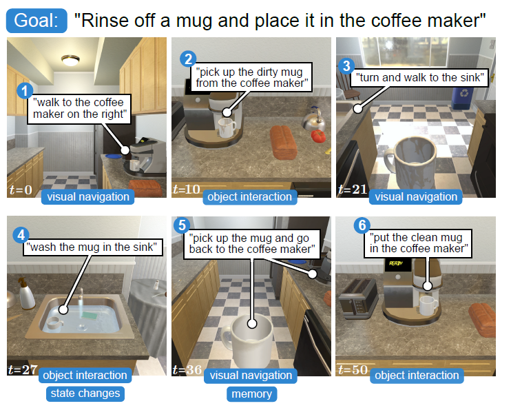

- ALFRED dataset
    - The dataset is based on [AI2-THOR](https://ai2thor.allenai.org) 2.0 simulator.
    - It consists of 25,743 english language directives describing 8,055 expert demonstrations averaging 50 steps each, resulting in 428,322 image-action pairs.
    - 7 tasks (pick & place, stack & place, pick two & place, clean & place, heat & place, cool & place, and examine in light).
    - It has 84 object classes (58 unique object classes and 26 receptacle object classes) in 120 scenes.
    - The objects have unique variants (dirty, clean, ...).
    - 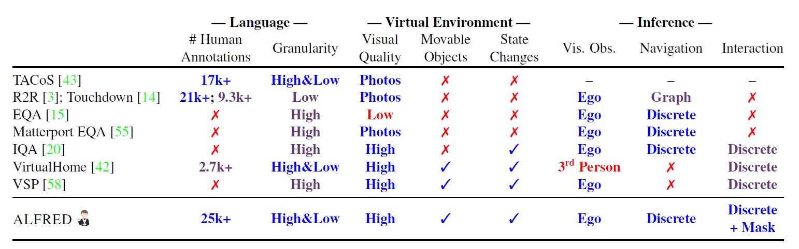
    - 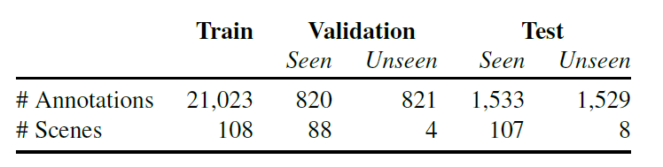
    - Example: 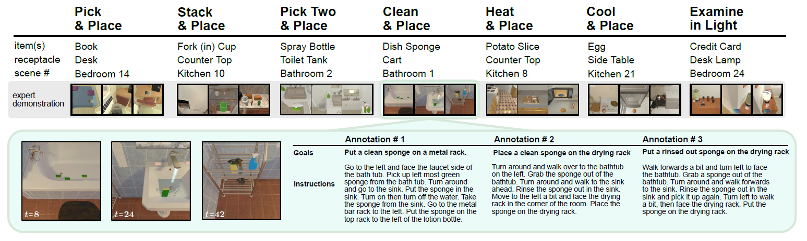
    - It suggest a model for training the new complex, realistic task...
        - 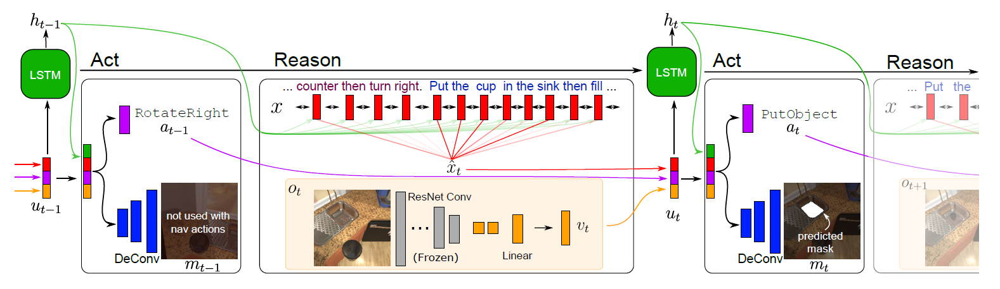
    
- Experiments
    - Even though they select a quite new training methods (progress monitor, LSTM, ...), the results are poor 
    because the lack of ability to reasoning capacity for a long-horizon & compositional task planning.
        - 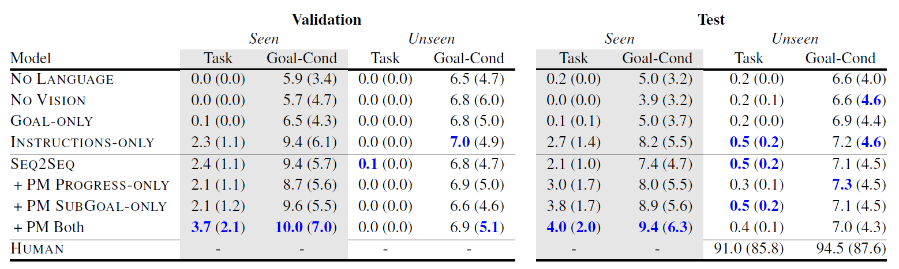
    - Not bad for the sub-goal
        - 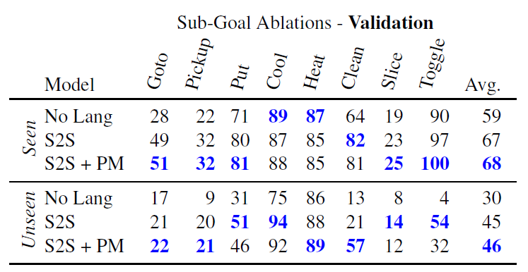