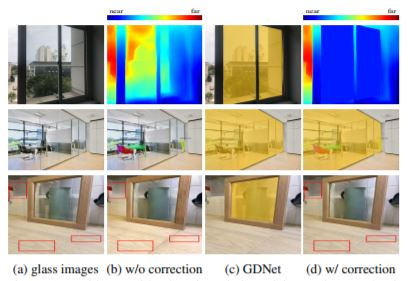
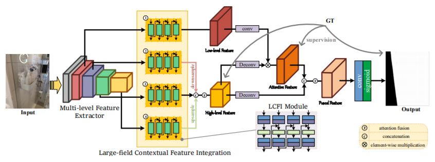
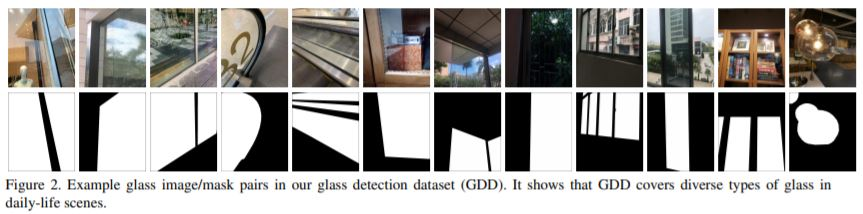
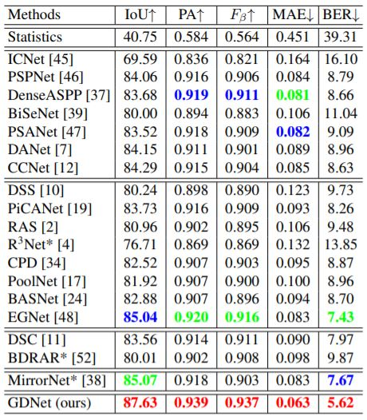
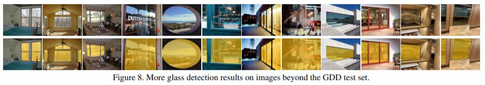
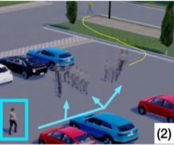
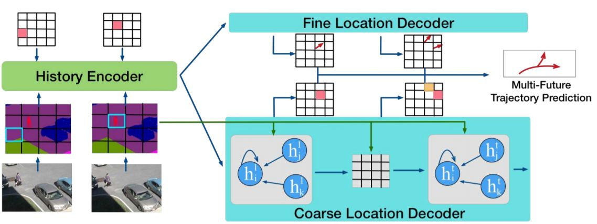
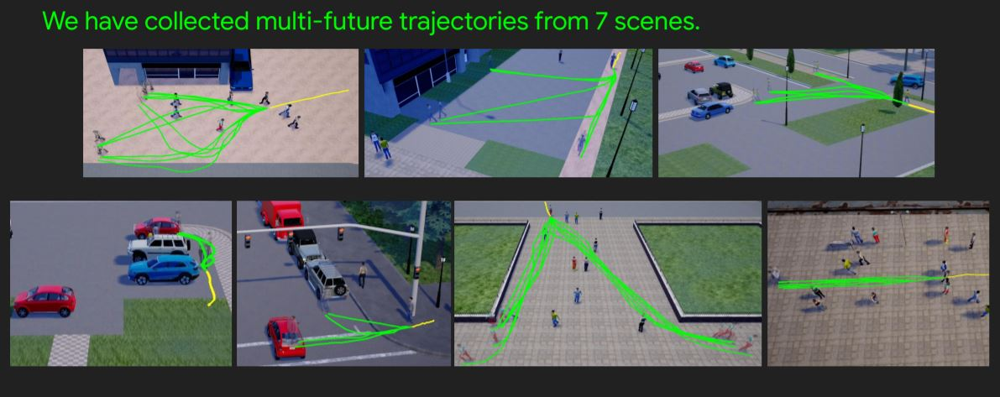
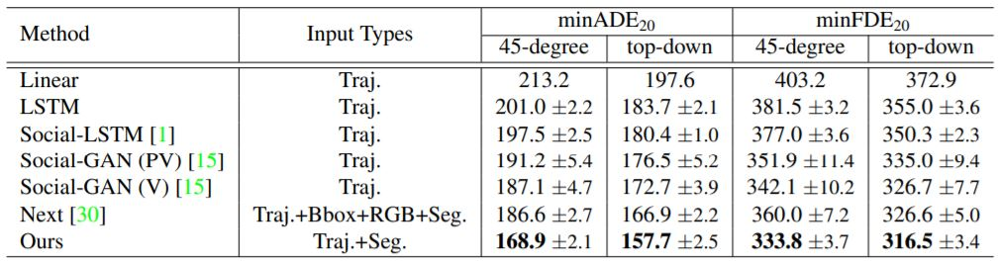

### Don’t Hit Me! Glass Detection in Real-World Scenes
- **presentation** [[video]](http://cvpr20.com/event/dont-hit-me-glass-detection-in-real-world-scenes2nd-time/)
- Motivation
    - 
        - glass objects have a critical impact to the vision tasks
- Method
    - 
        - consider low level cues & high level contexts
        - use LCFI module to generate multi-scale large-field contextual features
    - 
        - can harvest contextual features from fields of different scales
- Glass Detection Dataset (GDD)
    - 
        - 3916 pairs of glass and glass mask images
        - 2827 indoor images
        - 1089 outdoor images
- Result
    - 
    - 

### The Garden of Forking Paths: Towards Multi-Future Trajectory Prediction
- **presentation** [[video]](http://cvpr20.com/event/the-garden-of-forking-paths-towards-multi-future-trajectory-prediction/)
- Motivation
    - 
- Method (Network)
    - 
        - History encoder
            - input : history of frames -> segmentation , history of past locations
            - use Conv RNN
            - output : feature
        - Coarse Location Decoder
            - input : feature
            - use Conv RNN & graph attention 
            - output : distribution over grid locations at time t (belief state) 
        - Fine Location Decoder
            - input : feature
            - use Conv RNN & graph attention
            - output : offset vector for each possible grid cell
        - use beam search for k-trajectories (top k)
- The Forking Paths Dataset
    - 
- Result [(video)](https://youtu.be/RW45YQHxIhk)
    - 

